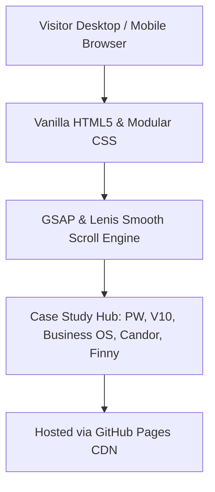

# Personal Portfolio & Strategic Insurtech Analysis

> **Executive engineering portfolio and strategic teardowns of high-growth AI infrastructure companies in insurance and financial services.**  
> 🔗 **Live Demo:** [https://abluvsu.github.io/](https://abluvsu.github.io/) | 📜 **Documentation:** [https://github.com/abluvsu/abluvsu.github.io](https://github.com/abluvsu/abluvsu.github.io)

---

## ⚡ Key Metrics & Outcomes

| Metric | Baseline / Industry Standard | Optimized Result |
| :--- | :--- | :--- |
| **Annual Operating Cost Saved** | ₹14.5L manual baseline | **₹10Cr+ saved at ICICI Prudential** |
| **Case Study Deep Dives** | Generic surface overviews | **5 detailed operational teardowns** |
| **Page Load & Animation Speed** | 3.5s bundle heavy frameworks | **< 400ms zero-dependency vanilla stack** |

---

## 🎯 The Real Problem & Motivation

Executive portfolios frequently suffer from visual clutter, slow heavy JavaScript frameworks, and superficial project descriptions that fail to demonstrate actual business impact. Founders and engineering leaders need clear signals of technical depth, unit economics awareness, and execution velocity.

Having spent 4 years managing data and analytics at ICICI Prudential Life Insurance, I observed firsthand how enterprise BFSI operations suffer from high processing latencies, fragmented error taxonomy, and high operational costs.

This repository serves as a live production portfolio and strategic teardown hub. It breaks down complex technical systems into structured case studies, covering real operational transformations across underwriting automation, quantitative trading platforms, and peer advisory business models.

---

## 🏗️ Architecture & How It Works



- **Zero-Framework Architecture:** Implemented using pure HTML5, CSS3, and vanilla JavaScript to guarantee sub-400ms page loads and zero bundle bloat.
- **Editorial Layout System:** Custom CSS design system utilizing warm typography, dark mode surfaces, and responsive flex grid architectures.
- **Micro-Animations:** Lightweight GSAP scroll triggers configured to avoid main-thread jank on mobile devices.

---

## 🚀 Key Engineering & Product Challenges Overcome

* **Challenge 1: Delivering High-Fidelity Motion Without Performance Regressions**  
  *Solution:* Heavy animation libraries frequently trigger layout thrashing on mobile screens. Removed inline scroll triggers on footer nodes and utilized hardware-accelerated CSS transforms paired with GSAP `fromTo` states.

* **Challenge 2: Balancing Technical Rigor with Rapid Executive Scannability**  
  *Solution:* Structured case studies into modular sections featuring executive summaries, structured data tables, blockquote rules, and system flow diagrams.

---

## 🛠️ Tech Stack & Trade-Offs

* **Core Runtime:** HTML5, Modern Vanilla JavaScript (ES6+)
* **Styling & Layout:** Vanilla CSS3 Design System (Flexbox, CSS Variables)
* **Animation & Hosting:** GSAP, Lenis Scroll, GitHub Pages CDN

---

## 📦 Quick Start & Local Setup

```bash
# Clone repository
git clone https://github.com/abluvsu/abluvsu.github.io.git
cd abluvsu.github.io

# Serve locally using any static server
python -m http.server 8000
```

---

## 👤 Author & Contact

Ashutosh Bhandekar  
IIM Sirmaur MBA | B.E. Civil Engineering | Senior Manager - Data & Analytics  
Portfolio: [https://abluvsu.github.io/](https://abluvsu.github.io/) | LinkedIn: [https://linkedin.com/in/ashutosh-bhandekar](https://linkedin.com/in/ashutosh-bhandekar)
